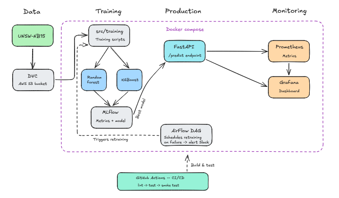
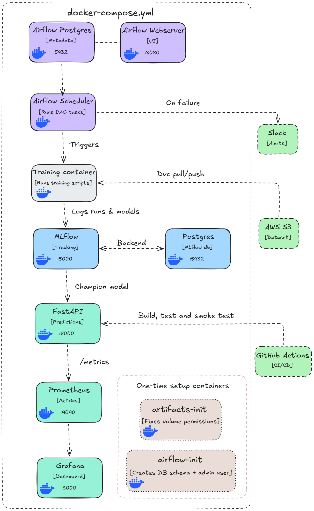
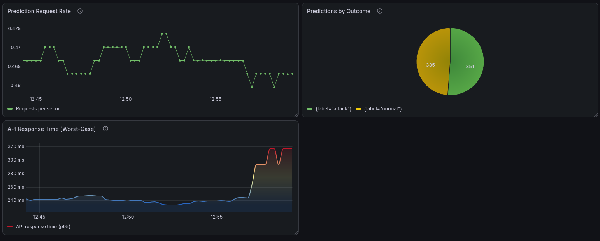
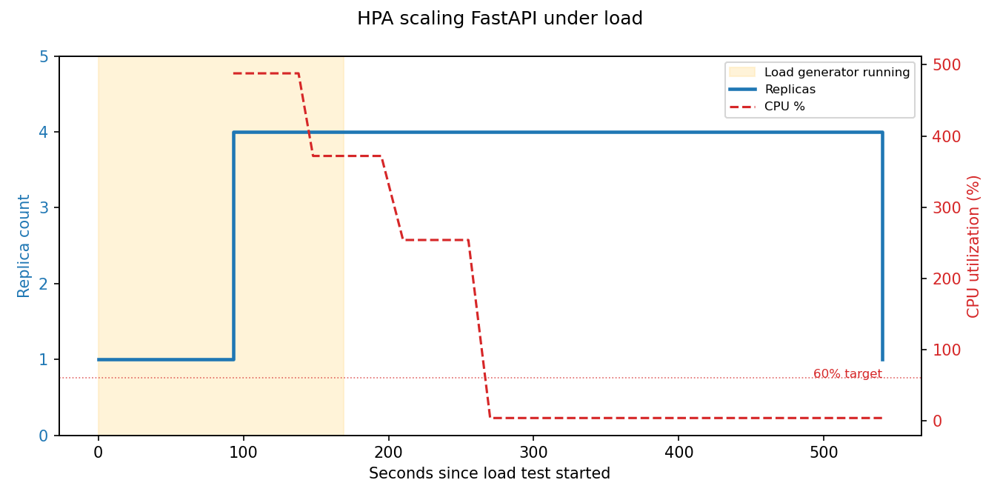

<a id="readme-top"></a>

# Network Intrusion Detection - MLOps Pipeline


**Author:** Daniel Hållbro (Student)<br>
**Course:** AI, Automation and Machine Learning<br>
**Assignment:** Advanced MLOps project<br>
**Program:** IT and Cybersecurity, Frans Schartaus Handelsinstitut<br>
**Tools:** DVC · AWS S3 · MLflow · PostgreSQL · FastAPI · Apache Airflow · Prometheus · Grafana · Docker Compose · Kubernetes · GitHub Actions<br>
**Dataset:** UNSW-NB15 - 175,341 training / 82,332 test network connections

---

## Overview

Network intrusion detection is a real-time cybersecurity problem - malicious traffic keeps arriving whether anyone's watching or not, faster than any analyst could review by hand. This pipeline classifies traffic as normal or attack as it arrives.

It also stays maintained after that: Airflow retrains it on a schedule, Grafana tracks the live service, and a better model gets promoted to production automatically the moment one wins.



Data flows from a public network-traffic dataset through cleaning and feature engineering, into two candidate model families (Random Forest and XGBoost), tracked and compared in MLflow. The best-performing model is served through a FastAPI endpoint. GitHub Actions builds and smoke-tests the whole stack on every push.

[⬆ Back to top](#readme-top)

---

## Features

- End-to-end MLOps pipeline, from raw data to a served, monitored prediction API
- Scheduled retraining with Apache Airflow
- Experiment tracking and model registry with MLflow
- Data versioning with DVC + AWS S3
- Infrastructure as Code with Terraform
- FastAPI prediction service, loading the current champion model dynamically
- Kubernetes deployment with a Horizontal Pod Autoscaler, scaling the API under real load
- Prometheus metrics + Grafana dashboard
- CI pipeline with an isolated Docker stack and real smoke tests

---

## Table of contents

1. [Overview](#overview)
2. [Features](#features)
3. [Why this dataset](#why-this-dataset)
4. [Data cleaning decisions](#data-cleaning-decisions)
5. [Results](#results)
6. [Runtime architecture](#runtime-architecture)
7. [Tech stack](#tech-stack)
8. [Monitoring](#monitoring)
9. [Kubernetes & autoscaling](#kubernetes--autoscaling)
10. [CI/CD](#cicd)
11. [Security](#security)
12. [Project structure](#project-structure)
13. [Running it locally](#running-it-locally)
14. [Key learnings](#key-learnings)
15. [Conclusion & real-world application](#conclusion--real-world-application)
16. [What's not (yet) included](#whats-not-yet-included)

---
## Why this dataset

UNSW-NB15 was chosen over several other candidate intrusion-detection datasets after evaluating class balance, size, and format. It's a modern network intrusion dataset created by the Australian Centre for Cyber Security (ACCS), generated using the IXIA PerfectStorm tool to produce a mix of real normal traffic and synthetic contemporary attack behavior, a more current alternative to older benchmark datasets from the late 1990s/early 2000s.

It also ships with an official, pre-split train/test file pair. The split is intentionally more difficult than a random shuffle, since the test set contains different traffic patterns than training. Model results reported below come from this official split, not an easier random resample, which is why the numbers look lower than some published results elsewhere (see [Key learnings](#key-learnings)).

- 175,341 training rows / 82,332 test rows, parquet format
- 68% attack / 32% normal traffic
- 9 attack categories (Reconnaissance, Exploits, DoS, and others)
- 36 original features per connection record

**Source:** [UNSW-NB15 on Kaggle](https://www.kaggle.com/datasets/dhoogla/unswnb15)

[⬆ Back to top](#readme-top)

---

## Data cleaning decisions

- `attack_cat` dropped, since it directly encodes the label (target leakage) and would never be available for a real, unseen connection
- `service='-'` (54% of rows) kept as its own `unknown` category, not dropped or treated as missing, since it's a legitimate value (e.g. ICMP/ARP have no application-layer service)
- `proto` (133 unique values, long-tail distribution): anything under 0.5% of training rows grouped into `other`, with the threshold computed dynamically from the data rather than hardcoded
- Two engineered ratio features (`sbytes/dbytes`, `spkts/dpkts`), measured to genuinely improve F1 by +0.003, and one ended up as the single most important feature in the final model

Full reasoning for each decision lives inline in [`src/training/preprocess.py`](src/training/preprocess.py); the exploration that led to them is in [`notebooks/`](notebooks/).

<details>
<summary><strong>Show src/training/preprocess.py</strong> (click to expand)</summary>

<pre><code class="language-python">
&quot;&quot;&quot;
preprocess.py - Cleans and prepares the UNSW-NB15 dataset for training.

Four decisions were made after exploring the data. Full reasoning for
each lives next to the code that implements it below. Quick summary:

1. Drop attack_cat and 6 other columns (attack_cat leaks the answer).
2. service &#x27;-&#x27; becomes &#x27;unknown&#x27; (it&#x27;s a real category, not missing data).
3. Rare protocols get grouped into &#x27;other&#x27; (long-tail distribution).
4. Two ratio features added to capture traffic asymmetry.

Golden rule followed throughout: everything we &quot;learn&quot; from the data
(which protocols are common, average values for scaling) is learned
from the TRAINING set only, then applied to the test set unchanged.
This is like training for an exam using only old exams, never peeking
at tomorrow&#x27;s exam questions. If we let information from the test set
leak into preparation, our results would look better than they&#x27;d
actually be in the real world.
&quot;&quot;&quot;

import os

import pandas as pd
from sklearn.preprocessing import StandardScaler

# ---------------------------------------------------------------
# STEP 1: Load the raw data
# ---------------------------------------------------------------
print(&quot;STEP 1: Loading raw data...&quot;)
train = pd.read_parquet(&quot;data/UNSW_NB15_training-set.parquet&quot;)
test = pd.read_parquet(&quot;data/UNSW_NB15_testing-set.parquet&quot;)
print(f&quot;  Loaded {len(train)} training rows and {len(test)} test rows.\n&quot;)

# ---------------------------------------------------------------
# STEP 2: Drop columns we don&#x27;t want the model to see
# ---------------------------------------------------------------
print(&quot;STEP 2: Dropping columns...&quot;)
# attack_cat directly reveals whether a row is an attack or not - the
# model would just read the answer instead of learning real patterns.
# It also would never exist in a real, live prediction request.
# The other 6 columns are dropped for a different reason: stcpb/dtcpb
# are raw TCP initial sequence numbers, essentially arbitrary
# per-connection identifiers rather than behavioral signal. The
# remaining four (is_ftp_login, ct_ftp_cmd, ct_flw_http_mthd,
# is_sm_ips_ports) are protocol-specific counters that only populate
# for FTP/HTTP traffic or rare IP/port edge cases - across the full
# dataset they&#x27;re mostly zero or constant, too sparse to generalize
# from.
COLUMNS_TO_DROP = [
    &quot;attack_cat&quot;, &quot;stcpb&quot;, &quot;dtcpb&quot;, &quot;is_ftp_login&quot;,
    &quot;ct_ftp_cmd&quot;, &quot;ct_flw_http_mthd&quot;, &quot;is_sm_ips_ports&quot;
]
train = train.drop(columns=COLUMNS_TO_DROP)
test = test.drop(columns=COLUMNS_TO_DROP)
print(f&quot;  Dropped: {COLUMNS_TO_DROP}\n&quot;)

# ---------------------------------------------------------------
# STEP 3: Fix the &#x27;service&#x27; column
# ---------------------------------------------------------------
print(&quot;STEP 3: Cleaning up &#x27;service&#x27; column...&quot;)
# &#x27;-&#x27; shows up in 54% of rows. It&#x27;s not missing data - it means &quot;no
# app-level protocol detected&quot; (normal for things like ICMP or ARP).
# We rename it to &#x27;unknown&#x27; so it reads clearly as its own category,
# instead of dropping over half our dataset.
train[&quot;service&quot;] = train[&quot;service&quot;].astype(str).replace(&quot;-&quot;, &quot;unknown&quot;)
test[&quot;service&quot;] = test[&quot;service&quot;].astype(str).replace(&quot;-&quot;, &quot;unknown&quot;)
print(&quot;  &#x27;-&#x27; renamed to &#x27;unknown&#x27;, kept as a real category.\n&quot;)

# ---------------------------------------------------------------
# STEP 4: Group rare network protocols together
# ---------------------------------------------------------------
print(&quot;STEP 4: Grouping rare protocols into &#x27;other&#x27;...&quot;)
# &#x27;proto&#x27; has 133 different values, but just a handful cover almost
# all the traffic (tcp, udp, etc). One-hot encoding all 133 as-is
# would create 133 mostly-empty columns. Instead, any protocol making
# up less than 0.5% of TRAINING rows gets grouped into &#x27;other&#x27;.
# The threshold is calculated from train data only (see golden rule
# above) so this logic would work the same on a fresh dataset too.
PROTO_RARITY_THRESHOLD_PCT = 0.5
proto_counts = train[&quot;proto&quot;].value_counts()
row_threshold = len(train) * (PROTO_RARITY_THRESHOLD_PCT / 100)
common_protocols = set(proto_counts[proto_counts &gt;= row_threshold].index)

def group_rare_protocols(df, common_set):
    return df[&quot;proto&quot;].astype(str).apply(
        lambda p: p if p in common_set else &quot;other&quot;
    )

train[&quot;proto&quot;] = group_rare_protocols(train, common_protocols)
test[&quot;proto&quot;] = group_rare_protocols(test, common_protocols)
print(f&quot;  Protocols kept individually: {sorted(common_protocols)}&quot;)
# Save the list so it can be logged as an artifact and reused
# identically by the API later - without this, the API has no way
# to know which protocols were &quot;common enough&quot; at training time.
import json

os.makedirs(&quot;models/preprocessing&quot;, exist_ok=True)
with open(&quot;models/preprocessing/common_protocols.json&quot;, &quot;w&quot;) as f:
    json.dump(sorted(common_protocols), f)
print(&quot;  Everything else grouped into &#x27;other&#x27;.\n&quot;)

# ---------------------------------------------------------------
# STEP 5: Add two new features (feature engineering)
# ---------------------------------------------------------------
print(&quot;STEP 5: Adding traffic ratio features...&quot;)
# sbytes/spkts = data sent FROM source TO destination.
# dbytes/dpkts = data sent BACK from destination to source.
# Normal traffic sends little, gets a lot back (small ratio).
# Attacks (floods, scans) often break that pattern (large or
# near-zero ratio). These two ratios give the model that signal
# directly instead of making it infer it from raw counts.
#
# +1 in the denominator avoids dividing by zero (dbytes/dpkts is 0
# in ~48% of rows).
for df in (train, test):
    df[&quot;sbytes_dbytes_ratio&quot;] = df[&quot;sbytes&quot;] / (df[&quot;dbytes&quot;] + 1)
    df[&quot;spkts_dpkts_ratio&quot;] = df[&quot;spkts&quot;] / (df[&quot;dpkts&quot;] + 1)
print(&quot;  Added: sbytes_dbytes_ratio, spkts_dpkts_ratio\n&quot;)

# ---------------------------------------------------------------
# STEP 6: One-hot encode the text columns
# ---------------------------------------------------------------
print(&quot;STEP 6: One-hot encoding proto / service / state...&quot;)
# Switched from pd.get_dummies() to sklearn&#x27;s OneHotEncoder. The old
# approach can&#x27;t be reused later - it just reads whatever categories
# happen to exist in the dataframe you pass it. OneHotEncoder is a
# proper fit/transform object: fit once on train, then reused as-is
# on test now, and later reused by FastAPI to encode a single live
# request the exact same way.
from sklearn.preprocessing import OneHotEncoder

CATEGORICAL_COLS = [&quot;proto&quot;, &quot;service&quot;, &quot;state&quot;]

# handle_unknown=&quot;ignore&quot; means if a live request someday has a
# category the encoder never saw during training, it gets encoded as
# all zeros instead of crashing the API.
# sparse_output=False returns a plain array instead of a memory-
# efficient sparse matrix - fine here, only 3 columns involved.
encoder = OneHotEncoder(sparse_output=False, handle_unknown=&quot;ignore&quot;)
encoder.fit(train[CATEGORICAL_COLS])

def encode_categoricals(df, encoder, cat_cols):
    encoded = encoder.transform(df[cat_cols])
    encoded_df = pd.DataFrame(
        encoded,
        columns=encoder.get_feature_names_out(cat_cols),
        index=df.index,
    )
    return pd.concat([df.drop(columns=cat_cols), encoded_df], axis=1)

train_encoded = encode_categoricals(train, encoder, CATEGORICAL_COLS)
test_encoded = encode_categoricals(test, encoder, CATEGORICAL_COLS)
print(f&quot;  Done. Train shape: {train_encoded.shape}, test shape: {test_encoded.shape}\n&quot;)

# ---------------------------------------------------------------
# STEP 7: Scale numeric columns
# ---------------------------------------------------------------
print(&quot;STEP 7: Scaling numeric features...&quot;)
numeric_cols = train_encoded.select_dtypes(
    include=[&quot;int64&quot;, &quot;int32&quot;, &quot;int16&quot;, &quot;int8&quot;, &quot;float32&quot;, &quot;float64&quot;]
).columns.tolist()
numeric_cols = [c for c in numeric_cols if c != &quot;label&quot;]

scaler = StandardScaler()
# Transforms each column to mean=0, std=1. fit_transform on train
# LEARNS the mean/std; transform (not fit_transform) on test REUSES
# them - the golden rule, written directly in code.
#
# Honest note: RF/XGBoost don&#x27;t actually need scaled inputs (trees
# split on relative order, not magnitude) - done anyway for
# consistency, in case a scale-sensitive model gets swapped in later.
train_encoded[numeric_cols] = scaler.fit_transform(train_encoded[numeric_cols])
test_encoded[numeric_cols] = scaler.transform(test_encoded[numeric_cols])
print(f&quot;  Scaled {len(numeric_cols)} numeric columns.\n&quot;)

# ---------------------------------------------------------------
# STEP 8: Save the processed data AND the fitted preprocessing objects
# ---------------------------------------------------------------
print(&quot;STEP 8: Saving processed data and preprocessing objects...&quot;)
import joblib

os.makedirs(&quot;data/processed&quot;, exist_ok=True)
train_encoded.to_parquet(&quot;data/processed/train.parquet&quot;, index=False)
test_encoded.to_parquet(&quot;data/processed/test.parquet&quot;, index=False)

# Saved separately from data/processed/ since these aren&#x27;t data, they&#x27;re
# fitted transformation objects. Training scripts load these and log
# them as MLflow artifacts alongside whichever model they train, so
# FastAPI can later pull the exact same scaler/encoder used at
# training time for any given run.
os.makedirs(&quot;models/preprocessing&quot;, exist_ok=True)
joblib.dump(scaler, &quot;models/preprocessing/scaler.pkl&quot;)
joblib.dump(encoder, &quot;models/preprocessing/encoder.pkl&quot;)
print(&quot;  Saved data/processed/train.parquet and test.parquet&quot;)
print(&quot;  Saved models/preprocessing/scaler.pkl and encoder.pkl\n&quot;)
# ---------------------------------------------------------------
# SUMMARY - what actually happened, in plain language
# ---------------------------------------------------------------
print(&quot;=&quot; * 60)
print(&quot;PREPROCESSING SUMMARY&quot;)
print(&quot;=&quot; * 60)
print(&quot;1. Dropped 7 columns, including attack_cat (target leakage)&quot;)
print(&quot;2. &#x27;service&#x27; = &#x27;-&#x27; relabeled as &#x27;unknown&#x27; (a real category)&quot;)
print(f&quot;3. Rare protocols grouped into &#x27;other&#x27; ({len(common_protocols)} kept individually)&quot;)
print(&quot;4. Added 2 ratio features for traffic asymmetry&quot;)
print(&quot;5. One-hot encoded proto/service/state, scaled numeric columns&quot;)
print(f&quot;6. Final shape -&gt; train: {train_encoded.shape}, test: {test_encoded.shape}&quot;)
</code></pre>

</details>

[⬆ Back to top](#readme-top)

---

## Results

Six candidate configurations were trained and compared in total: two untuned baselines, and four tuning attempts across both model families. The table below shows the four still-active candidates. Two earlier Random Forest tuning attempts (an overfitting demonstration and a since-replaced slower version) were retired and are documented in `src/training/legacy/` rather than repeated here.

The untuned Random Forest baseline won every comparison:

| Model | F1 (test set) | Precision | Recall |
|---|---|---|---|
| **Random Forest (baseline)** | **0.9214** ← champion | **0.9027** | **0.9409** |
| XGBoost (tuned) | 0.9189 | 0.8982 | 0.9406 |
| XGBoost (baseline) | 0.9175 | 0.9027 | 0.9328 |
| Random Forest (tuned v3) | 0.9167 | 0.8926 | 0.9421 |

While F1 was used as the primary ranking metric to handle the class imbalance, the untuned Random Forest baseline also achieved a strong ~94% recall - minimizing false negatives (missed attacks), which matters most for a real-world intrusion detection system.

Every GridSearchCV tuning attempt, across all six configurations tested, not just the four above, lost to the simple, untuned baseline. A real, measured result rather than an assumption that more tuning always helps. Random Forest's default settings already generalized well to the harder, official test split, XGBoost is often expected to edge it out, but not here, and not after real tuning attempts on both.

The champion's actual configuration: 100 trees, max depth 15, `class_weight="balanced"` to handle the 68/32 class split - see [Data cleaning decisions](#data-cleaning-decisions) and the dropdown below for the full reasoning behind each choice.

<details>
<summary><strong>Show src/training/train_random_forest.py</strong> (click to expand)</summary>

<pre><code class="language-python">
&quot;&quot;&quot;
train_random_forest.py - Trains a Random Forest baseline on the
processed UNSW-NB15 data and logs everything to MLflow.

This is the first of two models being compared (XGBoost comes next).
Random Forest is trained first because it&#x27;s simpler to reason about
and gives a baseline to compare XGBoost against later.
&quot;&quot;&quot;

import mlflow.sklearn
import pandas as pd
from common import log_preprocessing_artifacts
from sklearn.ensemble import RandomForestClassifier
from sklearn.metrics import accuracy_score, f1_score, precision_score, recall_score

import mlflow

# ---------------------------------------------------------------
# STEP 1: Load the already-processed data
# ---------------------------------------------------------------
print(&quot;STEP 1: Loading processed data...&quot;)
train = pd.read_parquet(&quot;data/processed/train.parquet&quot;)
test = pd.read_parquet(&quot;data/processed/test.parquet&quot;)

X_train = train.drop(columns=[&quot;label&quot;])
y_train = train[&quot;label&quot;]
X_test = test.drop(columns=[&quot;label&quot;])
y_test = test[&quot;label&quot;]
print(f&quot;  Train: {X_train.shape}, Test: {X_test.shape}\n&quot;)

# ---------------------------------------------------------------
# STEP 2: Connect to MLflow and start a run
# ---------------------------------------------------------------
print(&quot;STEP 2: Connecting to MLflow...&quot;)
from common import get_tracking_uri

mlflow.set_tracking_uri(get_tracking_uri())
mlflow.set_experiment(&quot;network-intrusion-detection-v2&quot;)
print(&quot;  Experiment set to &#x27;network-intrusion-detection-v2&#x27;\n&quot;)

with mlflow.start_run(run_name=&quot;random_forest_baseline&quot;):

    # -------------------------------------------------------
    # STEP 3: Train the model
    # -------------------------------------------------------
    print(&quot;STEP 3: Training Random Forest...&quot;)
    n_estimators = 100
    # Number of trees. More = a more stable average vote, but
    # returns shrink fast past ~100.
    max_depth = 15
    # Max depth per tree. Deeper trees can memorize noise
    # (overfitting) - 15 beat shallower options in testing.

    # class_weight=&quot;balanced&quot;: weights the rarer class higher during
    # training so the model can&#x27;t win by just favoring the common
    # class. Doesn&#x27;t touch the actual data, only the training cost.

    # random_state=42: fixes all randomness so re-running this script
    # produces the identical model every time.

    # n_jobs=-1: uses all CPU cores for THIS training run. Not the
    # same as Airflow&#x27;s PARALLELISM=1, which limits how many
    # DIFFERENT scripts run at once - they don&#x27;t conflict.
    model = RandomForestClassifier(
        n_estimators=n_estimators,
        max_depth=max_depth,
        class_weight=&quot;balanced&quot;,
        random_state=42,
        n_jobs=-1,
    )
    model.fit(X_train, y_train)
    print(&quot;  Training complete.\n&quot;)

    # -------------------------------------------------------
    # STEP 4: Log the parameters used
    # -------------------------------------------------------
    print(&quot;STEP 4: Logging parameters to MLflow...&quot;)
    mlflow.log_param(&quot;model_type&quot;, &quot;RandomForest&quot;)
    mlflow.log_param(&quot;n_estimators&quot;, n_estimators)
    mlflow.log_param(&quot;max_depth&quot;, max_depth)
    mlflow.log_param(&quot;class_weight&quot;, &quot;balanced&quot;)
    print(&quot;  Logged.\n&quot;)

    # -------------------------------------------------------
    # STEP 5: Evaluate on the test set
    # -------------------------------------------------------
    print(&quot;STEP 5: Evaluating on test data...&quot;)
    # predict() averages each tree&#x27;s predicted probability (soft
    # voting), not a simple majority vote of hard yes/no answers.
    y_pred = model.predict(X_test)

    # accuracy: % correct overall - can look good even on a weak
    # model here since classes aren&#x27;t balanced (68/32).
    accuracy = accuracy_score(y_test, y_pred)
    # precision: of what we called &quot;attack&quot;, how much really was.
    precision = precision_score(y_test, y_pred)
    # recall: of all real attacks, how many we caught - missing this
    # is the worse failure mode for an intrusion detector.
    recall = recall_score(y_test, y_pred)
    # f1: balances precision and recall - the metric that actually
    # picks the champion model (see promote_champion.py).
    f1 = f1_score(y_test, y_pred)

    print(f&quot;  Accuracy:  {accuracy:.4f}&quot;)
    print(f&quot;  Precision: {precision:.4f}&quot;)
    print(f&quot;  Recall:    {recall:.4f}&quot;)
    print(f&quot;  F1-score:  {f1:.4f}\n&quot;)

    # -------------------------------------------------------
    # STEP 6: Log metrics and the trained model itself
    # -------------------------------------------------------
    print(&quot;STEP 6: Logging metrics and model to MLflow...&quot;)
    mlflow.log_metric(&quot;accuracy&quot;, accuracy)
    mlflow.log_metric(&quot;precision&quot;, precision)
    mlflow.log_metric(&quot;recall&quot;, recall)
    mlflow.log_metric(&quot;f1_score&quot;, f1)
    mlflow.sklearn.log_model(
        model, &quot;model&quot;,
        registered_model_name=&quot;network-intrusion-detector&quot;
    )
    log_preprocessing_artifacts()
    print(&quot;  Logged. Run complete.\n&quot;)

print(&quot;Random Forest baseline finished. Check the MLflow UI to see this run.&quot;)
</code></pre>

</details>


[⬆ Back to top](#readme-top)

---

## Runtime architecture



The overview diagram (above) highlights the model-selection workflow, comparing Random Forest and XGBoost candidates. This diagram focuses on what's actually deployed and running, which is why it shows one training container rather than the individual model families, the model comparison already happened by the time this stage of the pipeline runs.

Terraform doesn't appear in this diagram on purpose: it provisions the S3 bucket and IAM user once, ahead of time, and isn't part of the running system shown here.

The diagram itself traces the actual flow, arrows and labels show exactly what triggers what. It reads top to bottom, starting with Airflow, which is what actually kicks off a training cycle. GitHub Actions sits on its own arrow into FastAPI since it runs independently on every push, not as a step inside the scheduled training cycle above it.

Color groups reflect subsystems: purple for the Airflow stack, blue for MLflow's, teal for the serving-and-monitoring trio, green for external services, tan for one-time setup containers. Airflow's Postgres is deliberately separate from MLflow's, since the two have different access patterns (Airflow's scheduler polls constantly), matching Apache's own reference architecture rather than sharing one database across both.

Two containers (`artifacts-init`, `airflow-init`) run once at startup, fixing shared-volume permissions and creating Airflow's database schema and admin user, then exit. They're not part of the ongoing request flow, which is why they're shown separately rather than inline with the persistent containers.

[⬆ Back to top](#readme-top)

---

## Tech stack

| Layer | Tool | Why |
|---|---|---|
| Data versioning | DVC + AWS S3 | Dataset never touches git, versioned like code instead |
| Infrastructure as Code | Terraform | Provisions the S3 bucket and IAM user as code, rather than clicking them together manually in the AWS console |
| Model training | scikit-learn (Random Forest), XGBoost | Two model families compared honestly, not assumed |
| Experiment tracking | MLflow + Postgres | Postgres over SQLite for real concurrent access, since the API, Airflow, and CI all touch it |
| Serving | FastAPI | Loads the current champion model dynamically via MLflow's registry, no hardcoded model path |
| Orchestration | Apache Airflow (LocalExecutor) | Schedules retraining, with a Slack alert on task failure |
| Monitoring | Prometheus + Grafana | Custom metrics: request rate, prediction outcomes, p95 latency |
| Containerization | Docker Compose | Every long-running service above is defined and orchestrated from one compose file |
| Autoscaling | Kubernetes (minikube) + HPA | Scales the FastAPI service between 1 and 4 pods based on CPU load, scoped to the one stateless service that benefits from it |
| CI/CD | GitHub Actions | Builds an isolated copy of the Docker stack on GitHub's own infrastructure, trains a dummy model, and smoke-tests the real API code path |

[⬆ Back to top](#readme-top)

---

## Monitoring



Three panels, each with a hover description explaining what it shows and why: request rate (is the API actually being used, and is that changing), predictions by outcome (a sudden shift in the attack/normal ratio is worth investigating), and API response time, worst-case (how slow the slowest normal requests get, not just the average, since an average can hide a real slowdown).

[⬆ Back to top](#readme-top)

---

## Kubernetes & autoscaling

The rest of the stack (Postgres, MLflow, Airflow, Prometheus, Grafana) still runs via Docker Compose exactly as described above. Only FastAPI, the one component that actually benefits from scaling under request load, runs in Kubernetes on a local `minikube` cluster, with a Horizontal Pod Autoscaler (HPA) watching it. A deliberate scope decision: the stateful services don't gain anything from horizontal scaling, so a full-stack migration is left as a future direction rather than something this addition needed to solve.

| Piece | File | Role |
|---|---|---|
| Deployment | `k8s/deployment.yaml` | Runs the FastAPI container as pods; each pod requests 100m CPU / 256Mi memory, capped at 500m CPU / 512Mi |
| Service | `k8s/service.yaml` | Stable internal address (`fastapi:8000`), load-balances across whichever pods currently exist |
| HorizontalPodAutoscaler | `k8s/hpa.yaml` | Watches average CPU utilization across pods, scales between 1 and 4 replicas, targeting 60% utilization |



Replica count and CPU utilization from a real run of `scripts/k8s_stress_test.sh`: a cold-start script that brings up Docker Compose, minikube, and the manifests from nothing, drives real concurrent load at the API, and confirms scaling. This run jumped from 1 to 4 replicas within about 90 seconds of load starting (CPU peaked at ~488% of the 100m request, i.e. genuinely saturating each pod's 500m limit), held at 4 for HPA's default 5-minute scale-down stabilization window after load stopped, then dropped back to 1. See [Key learnings](#key-learnings) for the one real wrinkle running FastAPI outside Compose caused.

[⬆ Back to top](#readme-top)

---

## CI/CD

Every push to `main` triggers a GitHub Actions workflow that spins up a second, fully isolated copy of the core stack (`docker-compose.ci.yml`), separate from the real development stack and using throwaway credentials, so nothing in CI ever touches real data, real secrets, or the real MLflow history.

Inside that isolated stack, the workflow:
1. Builds every Docker image fresh, to catch broken Dockerfiles or dependency issues early
2. Trains a small, fast dummy model (on synthetic data, not the real dataset) and registers it in the isolated MLflow instance as the champion
3. Starts the real API container and confirms it loads that dummy champion correctly via MLflow's registry, the exact same code path used in production
4. Sends a real prediction request and checks the response is well-formed
5. Sends a request with an unseen category value and confirms it's handled gracefully rather than crashing
6. Sends a malformed request and confirms it's rejected with a proper 422, not a silent failure

The whole isolated stack is torn down at the end of the run regardless of outcome, so nothing lingers between workflow runs.

[⬆ Back to top](#readme-top)

---

## Security

The following are never committed to this repo:
- AWS access keys and secret keys (DVC/S3 access), supplied via `.env`, never hardcoded
- Postgres, Airflow, and Grafana credentials, supplied via `.env`
- Slack webhook URL, supplied via `.env`
- The raw dataset itself, versioned via DVC/S3, not stored in git

`.env.example` documents every variable a real `.env` needs, with placeholder values only. `.gitignore` excludes `.env`, local DVC credentials, and MLflow's local SQLite database.

[⬆ Back to top](#readme-top)

---

## Project structure

The repository is organized by responsibility rather than by framework, training code, serving code, and orchestration each live in their own top-level folder.

```
├── src/training/                # preprocessing, training scripts, MLflow promotion
│   ├── legacy/                  # retired experiments (kept for reference)
│   └── experiments/             # standalone analyses (feature importance, ratio-feature impact)
├── api/                          # FastAPI service
├── airflow/dags/                 # retraining DAG
├── k8s/                           # Deployment, Service, HPA manifests for FastAPI
├── infra/                        # Terraform, provisions the S3 bucket + IAM user
├── data/                         # DVC pointer files (actual dataset pulled via dvc pull)
├── notebooks/                    # exploratory data analysis scripts
├── prometheus/                   # scrape config
├── grafana/dashboards/           # exported dashboard JSON
├── scripts/                      # see the table below
├── tests/                        # CI dummy-model smoke test
├── docs/images/                  # architecture diagrams, dashboard screenshot
├── .github/workflows/ci.yml      # GitHub Actions workflow: lint, build, smoke test
├── docker-compose.yml             # the real stack: all long-running services
├── docker-compose.ci.yml         # isolated stack used by CI
├── Dockerfile.api                 # builds the FastAPI service image
├── Dockerfile.mlflow              # builds the MLflow tracking server image
├── Dockerfile.airflow             # builds the Airflow webserver/scheduler image
├── Dockerfile.training            # builds the training container image (also used by Airflow tasks)
└── .env.example                   # template for real credentials, no real secrets
```

Seven scripts is a lot to keep straight, so here's what each one is actually for:

| Script | What it does | When to run it |
|---|---|---|
| `check_prerequisites.sh` | Verifies the required host tools are installed | Once, before anything else |
| `rebuild_pipeline.sh` | Brings up Compose, pulls data via DVC, trains all 4 candidate models, promotes a champion - from nothing | First real setup, or to prove the whole pipeline works end to end |
| `demo_check.sh` | Brings up Compose + Kubernetes and verifies every service, including a live prediction through K8s | Right before presenting or demoing |
| `simulate_traffic.sh` | Sends a steady stream of predictions so Grafana has live, moving data to show | A minute or two before showing the Grafana dashboard |
| `k8s_stress_test.sh` | Cold-starts everything and load-tests the HPA to prove it actually scales under real load | To (re-)verify the Kubernetes/HPA piece specifically, not for everyday use |
| `run_demo.sh` | A paced, six-stage walkthrough of the whole demo, advances one step at a time on Enter | During the actual live presentation |
| `plot_hpa_scaling.py` | Turns the CSV data `k8s_stress_test.sh` logs into the scaling chart used in this README | Called automatically by `k8s_stress_test.sh` - not meant to be run directly |

[⬆ Back to top](#readme-top)

---

## Running it locally

**Prerequisites:** Docker and Docker Compose, always. `terraform`, only for step 1 if you don't already have AWS credentials for this project's S3 bucket. `minikube` and `kubectl`, only for steps 3 and 5 (the Kubernetes/HPA piece). Run `./scripts/check_prerequisites.sh` to verify what you have before starting.

**1. Get AWS credentials, then create your own `.env`.** If you don't already have an access key for this project's S3 bucket, `infra/` provisions one: `cd infra && terraform init && terraform apply` creates the bucket, a scoped IAM user, and an access key (`terraform output dvc_access_key_id` / `terraform output -raw dvc_secret_access_key`). Then copy `.env.example` to `.env` and fill in real values (those AWS keys, Postgres passwords, Airflow's Fernet key and admin credentials, Slack webhook, Grafana admin). There's no automated setup script for this yet (see [What's not (yet) included](#whats-not-yet-included)), so every credential needs to be generated and entered manually before anything below will actually run.

**2. Bring the data and a trained champion model up from nothing** (also brings up the Docker Compose stack itself; requires valid AWS credentials in `.env` to pull the dataset from S3):

```bash
./scripts/rebuild_pipeline.sh
```

**3. Bring up Kubernetes and check everything's healthy before a demo** (also brings up Docker Compose if it isn't already running):

```bash
./scripts/demo_check.sh
```

**4. Generate some live traffic to see the Grafana dashboard move:**

```bash
./scripts/simulate_traffic.sh
```

**5. Try the Kubernetes autoscaling** (requires `minikube` and `kubectl`, brings up the FastAPI Deployment/Service/HPA on top of the running stack and load-tests it end to end):

```bash
./scripts/k8s_stress_test.sh
```

**6. Access the services:**
- **FastAPI:** `http://localhost:8000/docs`
- **MLflow:** `http://192.168.49.1:5001` (bound to minikube's gateway IP, not localhost - see [Kubernetes & autoscaling](#kubernetes--autoscaling))
- **Airflow:** `http://localhost:8080`
- **Prometheus:** `http://localhost:9090`
- **Grafana:** `http://localhost:3000`

[⬆ Back to top](#readme-top)

---

## Key learnings

### Data and modeling

**The official train/test split matters more than the F1 number alone.** Published results on this dataset vary wildly (77%-99%) depending on whether the evaluation used the official, harder split or a random resample. A hold-out test on the real split gave a comparable result (~91%) to this project's own numbers, evidence that a lower-looking score can reflect a more honest evaluation, not a worse model.

**Tuning doesn't always help, and measuring that beats assuming it.** Every GridSearchCV attempt (across both model families, multiple grid sizes) lost to the untuned Random Forest baseline. One tuning run even reproduced a textbook overfitting case: highest cross-validation score of all six candidates, worst test-set score of all six, a direct demonstration of why held-out evaluation matters more than CV score alone.

### Infrastructure and operations

**Running everything in parallel isn't always the right call.** An early attempt to run all four training candidates simultaneously through Airflow oversubscribed a 4-core development machine, since each script also internally parallelizes via GridSearchCV. Capping Airflow to sequential execution traded some wall-clock time for a stable, predictable pipeline, the right tradeoff for the available hardware.

**A model registry needs a real backend once more than one thing touches it.** MLflow ran on SQLite during early development, then moved to Postgres once the API, Airflow, and CI all needed to read from it. SQLite's single-writer limitation becomes a real constraint the moment more than one process is involved, not just a theoretical concern.

**A `docker compose` command operates on every service in scope, not just the one you're thinking about.** Tearing down an isolated CI test stack with `docker compose -f docker-compose.yml -f docker-compose.ci.yml down -v` also wiped the real development stack's volumes, MLflow's champion history and Airflow's metadata included, since merging both compose files puts every service from both files in scope for that command, not just the CI-specific ones. Recovered via `rebuild_pipeline.sh`, but the real lesson was to be explicit about exactly which services a teardown targets, not just which files get passed to the command.

**Kubernetes doesn't share anything with Docker Compose by default.** Pulling FastAPI out into a separate minikube cluster broke its normal path to MLflow: a pod can't resolve a Compose service name like `mlflow`, and can't mount a Compose volume either, both only exist inside the Compose network. Fixed by having MLflow also serve its artifacts over plain HTTP instead of relying solely on a shared volume, and pointing the pod at `host.minikube.internal`, minikube's built-in route back to the host machine. A concrete example of how adding a new orchestration layer can quietly invalidate assumptions the rest of the stack didn't know it was relying on.

[⬆ Back to top](#readme-top)

---

## Conclusion & real-world application

This isn't a finished product, and getting it running somewhere else from scratch would take real work - but it does show every piece of an MLOps pipeline actually working together, from raw data to a model a security team could query live. In a real SOC I'd expect something like this to sit alongside slower batch analysis (which the Airflow side of this project already hints at), not replace it - fast triage now, deeper analysis later.

Building it also made the model's actual limits pretty obvious to me, and I'd rather say them out loud than pretend they're not there:

- I never tested it against adversarial input, and I probably should have. `sbytes_dbytes_ratio` turned out to be one of the most valuable engineered features (see [Data cleaning decisions](#data-cleaning-decisions)) - which also means it's an obvious thing to target if someone wanted to shape traffic to sneak past it.
- The API has zero authentication right now. Totally fine for a school project running on my own VM, not fine for anything real.
- Nothing here detects concept drift. The model is frozen at whatever UNSW-NB15 looked like when I trained it - Airflow retrains it on a schedule, but that's not the same as noticing when it's gone stale.

So this is a working prototype that proves the pipeline - it would need real testing and tuning against production traffic before I'd trust it with anything live.

[⬆ Back to top](#readme-top)

---

## What's not (yet) included

- **Full Kubernetes migration**: Postgres, MLflow, Airflow, Prometheus, and Grafana still run via Docker Compose; only FastAPI runs in Kubernetes so far (see [Kubernetes & autoscaling](#kubernetes--autoscaling))
- **Container registry (GHCR)**: the API image is built directly into minikube's own Docker daemon (`imagePullPolicy: Never`), not pushed anywhere - deliberate for now, since a purely local build can't fail from bad demo-day wifi the way a registry pull could. Pushing to `ghcr.io` (using the `GITHUB_TOKEN` already available in CI, no new secret needed) so a fresh clone could `kubectl apply -f k8s/` without building locally first is the natural next step.
- **A guided first-time setup script** (prompting for credentials to generate `.env`): planned, not yet built

[⬆ Back to top](#readme-top)

---

*Repo: [MLOps_Pipeline](https://github.com/DanielHallbro/MLOps_Pipeline)*